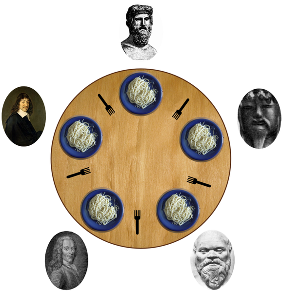
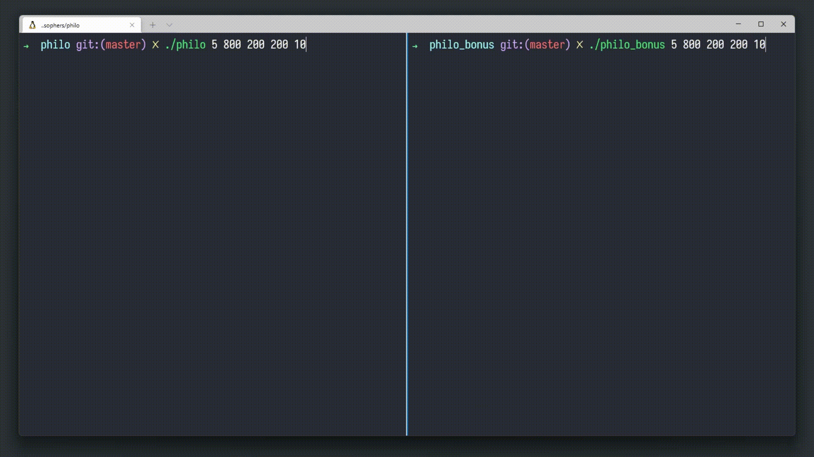

# Philosophers
In computer science, [The Dining Philosopher Problem](https://en.wikipedia.org/wiki/Dining_philosophers_problem) is an example problem often used in concurrent algorithm design to illustrate synchronization issues and techniques for resolving them.

### What is Philosophers?
Philosophers is an individual project at [42](42sp.org.br) that requires us to solve [The Dining Philosopher Problem](https://en.wikipedia.org/wiki/Dining_philosophers_problem) problem using threads, processes, mutex and semaphores.
The mandatory part must be solved using [threads](https://man7.org/linux/man-pages/man7/pthreads.7.html) and [mutex](https://www.unix.com/man-page/linux/5/mutex/). The solution was implemented using a monitoring thread, which checks if any philosopher has died and warns others to stop ([locking mutex](https://linux.die.net/man/3/pthread_mutex_lock)).
The bonus consists of using [processes](https://stackoverflow.com/questions/200469/what-is-the-difference-between-a-process-and-a-thread#:~:text=A%20process%20is%20a%20collection,concurrently%20within%20the%20same%20process.) instead of threads and [semaphores](https://man7.org/linux/man-pages/man7/sem_overview.7.html) instead of mutex, to solve it the solution used was to implement the death check between the [sleeping](https://man7.org/linux/man-pages/man3/usleep.3.html) times, avoiding the problem of reporting the death of a philosopher with more than 10ms.

#### Problem statement

The problem was proposed by <a href="https://pt.wikipedia.org/wiki/Edsger_Dijkstra">Edsger W. Dijkstra</a> in 1965 and is considered one of the classic problems about operating systems.
The problem consists of five philosophers sitting around a circular dinner table, where each philosopher has a plate for eating spaghetti and a fork to his right. To eat they need 2 forks but there is only one fork between each pair of plates. A philosopher has three actions: eating, thinking, or sleeping. When a philosopher gets hungry he will try to take the fork to his right and to his left, one at a time. If he manages to get both forks, he will eat the food at a certain time and will put the forks on the table, going to sleep and then going to think again.

### Preview
**Mandatory vs Bonus**

### Badge

#### Arguments
All arguments working with mandatory and bonus

<table>
    <thead>
        <tr>
            <th colspan=5><h4>Arguments Usage</h4></th>
        </tr>
        <tr>
            <th>#1</th>
            <th>#2</th>
            <th>#3</th>
            <th>#4</th>
            <th>#5</th>
        </tr>
        <tr>
            <td align="center">5</td>
            <td align="center">800</td>
            <td align="center">200</td>
            <td align="center">200</td>
            <td align="center">10</td>
        </tr>
        <tr>
            <td align="center"><strong>number_of_philosophers</strong></strong></td>
            <td align="center"><strong>time_to_die</strong></td>
            <td align="center"><strong>time_to_eat</strong></td>
            <td align="center"><strong>time_to_sleep</strong></td>
            <td align="center"><strong>*number_of_times_each_must_eat</strong></td>
        </tr>
    </thead>
    <tbody>
        <tr>
            <td colspan=5>*The last argument, <strong>number_of_times_each_must_eat</strong> is optional.</td>
		 </tr>
    </tbody>
</table>
